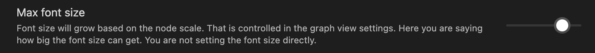

# Graph View Text Size

This is an `alpha` plugin for [Obsidian](https://obsidian.md).

## What it solves

Text size in Graph View is too small to read. This is a simple plugin to increase the text size based on the node size.

You can adjust the maximum text size in the plugin settings.

## Manually installing the plugin

> This is a very hacky solution, since there's no official API to modify the graph view. It may break in future updates.

As this is an `alpha` version,  it's not yet published. Clone the repo to your vault:

From the command line:

`cd [VaultFolder]/.obsidian/plugins/`

`git clone git@github.com:libasoles/graph-view-text-size.git`

## Why I did this anyway?

I use glasses to read and I have a hard time reading the graph view. And I saw a couple of feature requests in the forum:
[Adjust Graph Font Size, CSS Solution?](https://forum.obsidian.md/t/request-adjust-graph-font-size-css-solution/6461) &&
[Obsidian graph view as Community plugin](https://forum.obsidian.md/t/obsidian-graph-view-as-community-plugin/18042/3)

Then I saw a couple plugins that managed to modify the graph view, so I decided to give it a try. So, this is insspired on [obsidian-graph-nested-tags](https://github.com/drPilman/obsidian-graph-nested-tags) and [folders-graph](https://github.com/Ratibus11/folders2graph)
