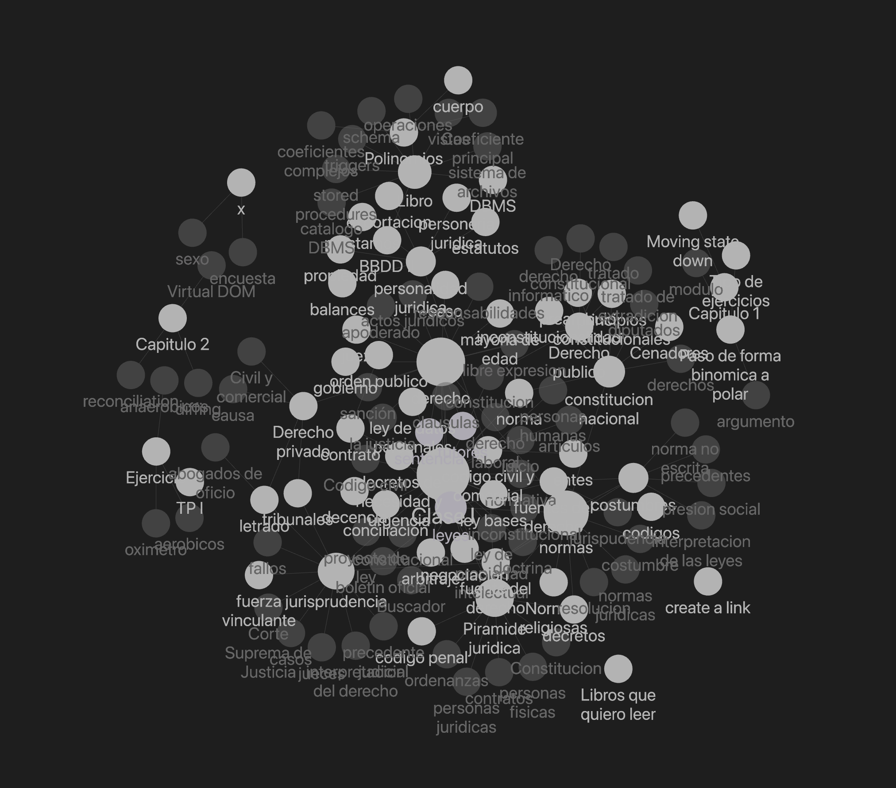

# Graph View Text Size

This is a `beta` plugin for [Obsidian](https://obsidian.md).


## What it solves

Text size in Graph View is too small to read. This is a simple plugin to increase the text size based.

There are two modes:

- Text size based on the node size.
- Text size independent of the node size (all links will have the same size).


You can adjust the maximum text size in the plugin settings.


## Manually installing the plugin

> This is a hacky solution since there's no official API to modify the graph view. It may break in future Obsidian updates. And it might feel clunky in some aspects. I haven't tested it with huge graphs, so be aware than it might hang Obsidian, specially with big font sizes. If that's the case, it should take a minute to recover. Otherwise, just delete the plugin from the folder.

As this is `beta` version,  it's not yet published.

You have two options:

### Download

You can download a build version in zip mode from the [releases](https://github.com/libasoles/graph-view-text-size/releases) page.

Unzip the file into `[VaultFolder]/.obsidian/plugins/`.

Then enable the plugin in Obsidian settings > `Community plugins`.

### Clone the repo

Or clone the repo to your vault from the command line:

`cd [VaultFolder]/.obsidian/plugins/`

```bash
git clone git@github.com:libasoles/graph-view-text-size.git

cd graph-view-text-size

npm install

npm run build
```

Then enable the plugin in Obsidian settings > `Community plugins`.

Use `npm run dev` if you plan to modify the code.

## Why I did this anyway?

I use glasses and I have a hard time reading the graph view. Also I saw a couple of feature requests in the forum:
[Adjust Graph Font Size, CSS Solution?](https://forum.obsidian.md/t/request-adjust-graph-font-size-css-solution/6461) and
[Obsidian graph view as Community plugin](https://forum.obsidian.md/t/obsidian-graph-view-as-community-plugin/18042/3)

Then I found a couple plugins that managed to modify the graph view, so I decided to give it a try and build my own plugin. Anyway, this is inspired on [obsidian-graph-nested-tags](https://github.com/drPilman/obsidian-graph-nested-tags) and [folders-graph](https://github.com/Ratibus11/folders2graph)

## Additonal features

I added a feature to change the color of the node based on the tag color. It's not perfect, but it's a start.


